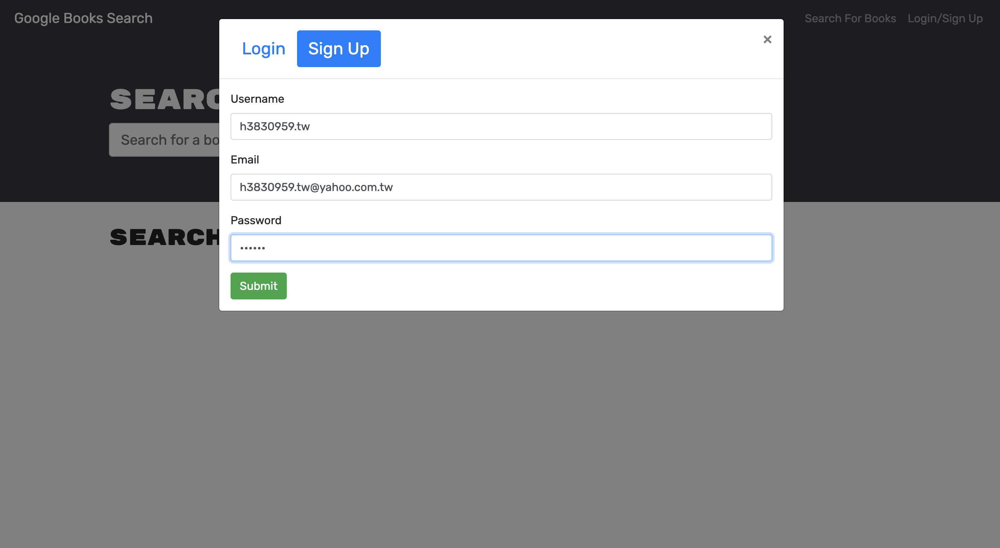
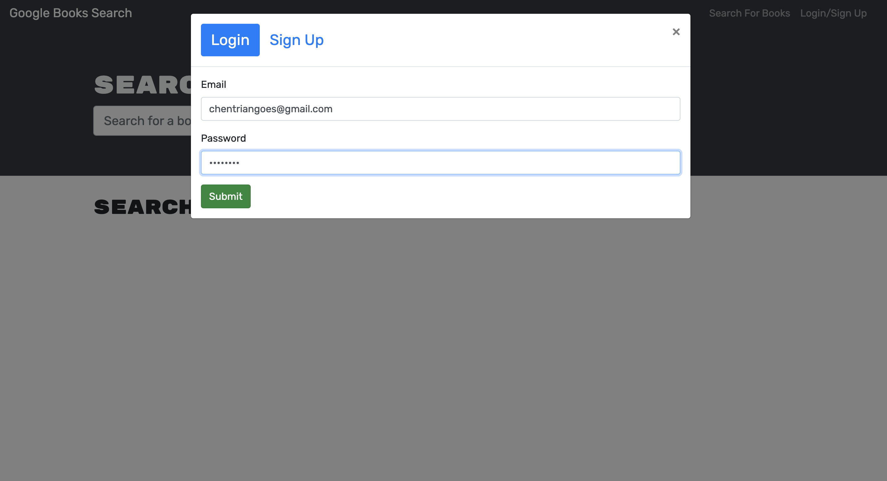

# BooksSearchEngine
An MERN app utilising Apollo Server to use GraphQL for users to search for Books based on their search input. Registered users can save items as a list of their account.


## 📋 Description
This project is to create a book search engine with Apollo Server, React front end, MongoDB database, and Node.js/Express.js server and API. Every visitor to the book search engine can look up for books with titles containing the key word of their input. Users can also register their accounts to save books of their searched items as the list of books. Delete function is available for users to removed any saved item from the book list. This book search engine app is further cacheing user's login record to save time for their next visit.

### 📽 Demonstration
Demo video 
* [Functionality of Book Search Engine](https://drive.google.com/file/d/10N57ULeUeptBYV0pRnOJawQwj55V6QYE/view?usp=sharing)

### 📷 Screenshots
* Book Search_Visitors


* Signup


* Login


* Book Search_Account Holders


* Books List_Account Holders


## 🕹 Technologies
* [Express.js](https://www.npmjs.com/package/express.js)
* [Node.js](https://www.npmjs.com/package/node.js)
* [Apollo-server](https://www.apollographql.com/docs/apollo-server/v2/getting-started)
* [Apollo/client](https://www.apollographql.com/docs/react/get-started)
* [React-boostrap](https://react-bootstrap.github.io/getting-started/introduction)
* [concurrently](https://www.npmjs.com/package/concurrently)
* [bcrypt](https://www.npmjs.com/package/bcrypt)
* [jsonwebtoken](https://www.npmjs.com/package/jsonwebtoken)
* [mongoose](https://www.npmjs.com/package/mongoose)
* [nodemon](https://www.npmjs.com/package/nodemon)
* [react-dom](https://www.npmjs.com/package/react-dom)
* [react-router-dom](https://www.npmjs.com/package/react-router-dom)
* [react-scripts](https://www.npmjs.com/package/react-scripts)

## Installation
Install dependencies
```
npm i
```

Run the application
```
npm run develop
```

## Troubleshooting
How to deploy MERN project to Heroku
* [MERN to Heroku](https://coding-boot-camp.github.io/full-stack/mongodb/deploy-with-heroku-and-mongodb-atlas)

## ⛓ Links
Depolyed to Heroku:
https://sleepy-bayou-01599.herokuapp.com/
 
Source Codes
https://github.com/chentriangoes/BooksSearchEngine

## ☎️ Questions
For any questions about the project/repository please contact me @ [chentriangoes@gmail.com](mailto:chentriangoes@gmail.com) </br>
GitHub @ [chentriangoes](https://github.com/chentriangoes) 
